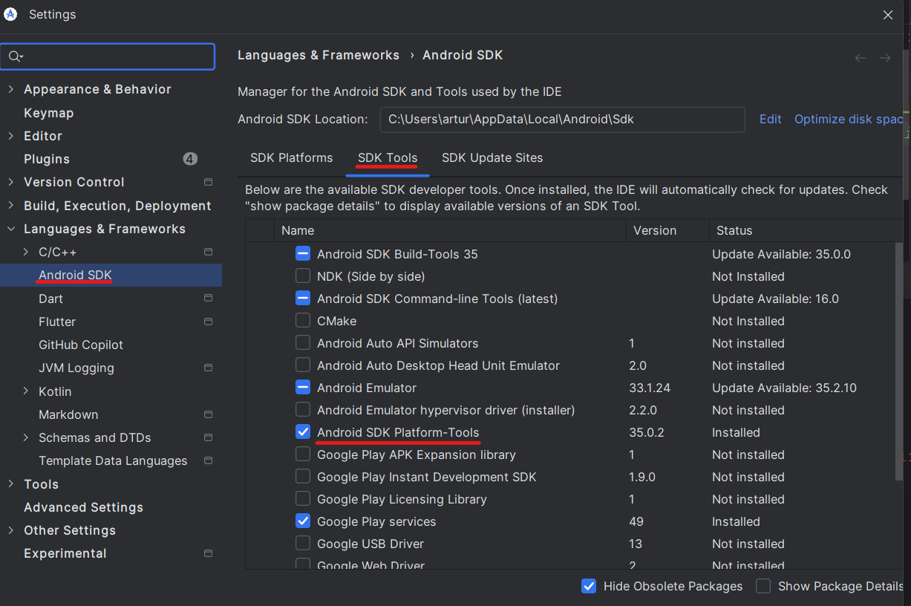
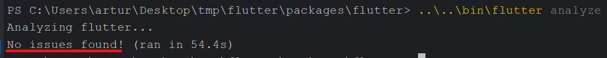
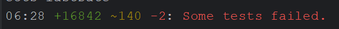

# Configuring the Environment

Before starting the development process, we are going to set up our environment. 
To do that, the following steps should be completed: 
1. Install necessary tools
1. Configure the Git environment
1. Sanity Check
    - Run the analyzer
    - Run some tests
    - Run some examples

## Tools
Given that the focus of this book is not on those tools, they will be listed 
with only enough information, adding any additional information as external 
resources.

- **Git**: Used as source version control. 
    - <a href="https://git-scm.com/downloads" target="_blank">Download and install</a>
    - <a href="https://git-scm.com/doc" target="_blank">Documentation</a>
        - <a href="https://git-scm.com/docs" target="_blank">Reference Manual</a>
        - <a href="https://git-scm.com/book/" target="_blank">Book</a>
        - <a href="https://training.github.com/" target="_blank">Cheat Sheet</a>
    - Related repositories: <a href="https://github.com/flutter/flutter" target="_blank">Flutter</a>, <a href="https://github.com/join-the-flock/flock" target="_blank">Flock</a>
- **Integrated Development Environment (IDE)**: there are a lot of IDEs out there, but two are very popular among flutter developers. Install the IDE with the *Flutter plugin/extensions* for each: 
    - <a href="https://docs.flutter.dev/tools/android-studio" target="_blank">Android Studio</a>
    - <a href="https://docs.flutter.dev/tools/vs-code" target="_blank">Visual Studio Code</a>
- **Python**: Some tools require that you have Python installed on your machine.
    - <a href="https://www.python.org/downloads/" target="_blank">Download and install</a>
- **Android Platform Tools**: Android SDK Platform-Tools is a component for the Android SDK. It includes tools that interface with the Android platform, primarily adb and fastboot. Although adb is required for Android app development, app developers will normally just use the copy Studio installs.
    - **Android Studio on Windows**: Usually, the Android SKD Platform-Tools are in the path: `C:\Users\<your_user>\AppData\Local\Android\Sdk\platform-tools`
    - **Activate those tools from your Android Studio** following the path `Tools/SDK Manager/Android SDK/SDK Tools`:
    
    - <a href="https://developer.android.com/tools/releases/platform-tools" target="_blank">Download</a> if you are not using the version from your IDE.

    <!-- TODO Is there any other tool that you can remember? Maybe something specific for flock. -->
    
## Configuring the Git Environment
The following tutorials show how to set up your git environment for both the
Original Flutter and the Flock repositories.  
### For Flutter
1. Clone the flutter/flutter repo using either SSH or HTTPS (SSH is recommended, but requires a working [SSH key](https://docs.github.com/en/authentication/connecting-to-github-with-ssh/about-ssh) on your GitHub account):
    - SSH: 
    ```bash
    git clone git@github.com:flutter/flutter.git
    ```
    - HTTPS: `git clone https://github.com/flutter/flutter.git`
    ```bash
    git clone https://github.com/flutter/flutter.git
    ```

1. Change into the directory of the cloned repository and rename the origin remote to upstream:
    ```bash
    cd flutter
    git remote rename origin upstream
    ```

1. [Fork the flutter/flutter repo](https://github.com/flutter/flutter/fork) into your own GitHub account.

1. Add your fork as the origin remote to your local clone either using SSH or HTTPS by replacing `<your_user>` with your GitHub account name:
    - SSH: 
    ```bash
    git remote add origin git@github.com:<your_user>/flutter.git
    ```
    - HTTPS: 
    ```bash
    git remote add origin https://github.com/<your_user>/flutter.git
    ```

1. Verify the upstream and origin repository you've specified for your clone.
    ```bash
    git remote -v
    ```

1. Add the repo's `bin` directory to your [PATH](https://en.wikipedia.org/wiki/PATH_(variable)): e.g. on UNIX, using `export PATH="$PATH:$HOME/<path to flutter repository>/bin"`

    - If you already have a Flutter installation you will either need to remove it from your PATH, or use a full path whenever you are running `flutter` in this repository. If you have version solving errors when trying to run examples below, you are running a version of Flutter other than the one checked out here.

1. `flutter update-packages`

   This will recursively fetch all the Dart packages that
   Flutter depends on. If version solving failed, try `git fetch upstream` to update Flutter versions before `flutter update-packages`.


### For Flock
TODO: consider contributing writing this part.


## Sanity Check
After configuring the repository, it is useful to perform  initial
checks to ensure everything is set up correctly. We are going to run the dart analyzer, 
the unit tests of the Framework, and some examples.

### Running the Analyzer
The dart analyzer is a static analysis tool that may be configured to
perform a lot of different checks in the dart code, allowing the identification
of bugs in an early stage (static analysis happens without the need of running
the code), automating some style specification, and more. 

It is very important for the Flutter/Flock framework development process, and it
is a good idea to start running it in your code to make you used to the process.

- Supposing that you are in the project root, change the directory to the flutter
package:
```bash
cd packages/flutter
```
- Execute the analyzer:
```bash
../../bin/flutter analyze 
```
or, if you have configured PATH:
```bash
flutter analyze 
```

When the project analysis completes successfully, you will see a confirmation 
message indicating that no issues were found, as shown in the image below:



You have now successfully completed the analyzer setup. Moving forward, you can 
utilize this tool to evaluate your code changes. As a best practice, run the 
analyzer before committing any new code to ensure quality and consistency.

### Running Tests
Testing represents a crucial component of code specification. Regular test 
execution is essential to maintain code integrity. A recommended practice is to 
run tests before each commit to ensure new code changes don't introduce 
regressions or break existing functionality.

To execute the complete framework test suite, use the following command from 
your current directory (`<root>/packages/flutter`):
```bash
../../bin/flutter test
```

Please note that a full test execution requires significant time. As illustrated
in the image below, the complete suite took over 6 minutes to run:



The framework contains approximately 17,000 tests (early 2025), which explains 
the extended execution time. However, during development, you'll learn more 
efficient approaches to run targeted test subsets. The complete suite execution 
can be reserved for pre-commit validation.

The example execution above demonstrates positive results: the majority of tests
passed successfully. Some tests were marked as ignored (displayed in orange), 
and only two tests failed (displayed in red). While test failures can occur for 
various reasons, these results indicate a generally successful test execution, 
allowing us to proceed to the next phase.

The current Flutter project baseline shows: clean analyzer output and nearly all
tests passing. Your code changes should maintain this quality level without 
introducing new analyzer issues and test failures.

### Running Examples

### Making a HelloWorld widget

## References
- Flutter Contribution Guide: <a href="https://github.com/flutter/flutter/blob/master/CONTRIBUTING.md" target="_blank">CONTRIBUTING.md</a>
- Setting up the Framework Development Environment: <a href="https://github.com/flutter/flutter/blob/master/docs/contributing/Setting-up-the-Framework-development-environment.md" target="_blank">Setting-up-the-Framework-development-environment.md</a>
- Video tutorial on how to contribute to the Flutter Framework: <a href="https://www.youtube.com/watch?v=4yBgOBAOx_A" target="_blank">How to contribute to Flutter (The Boring Flutter Development Show, Ep. 53)</a>
