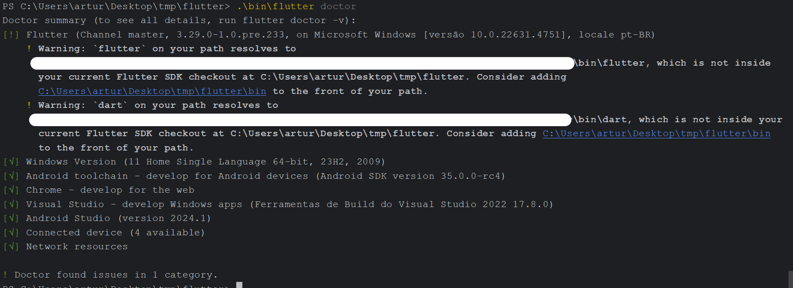
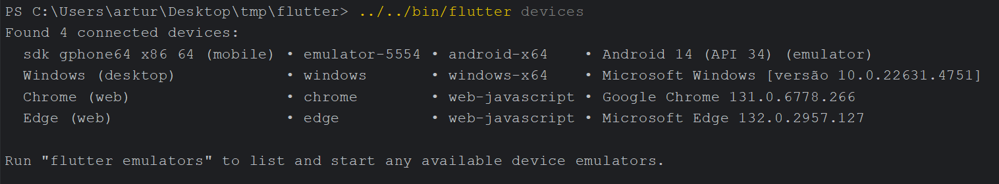
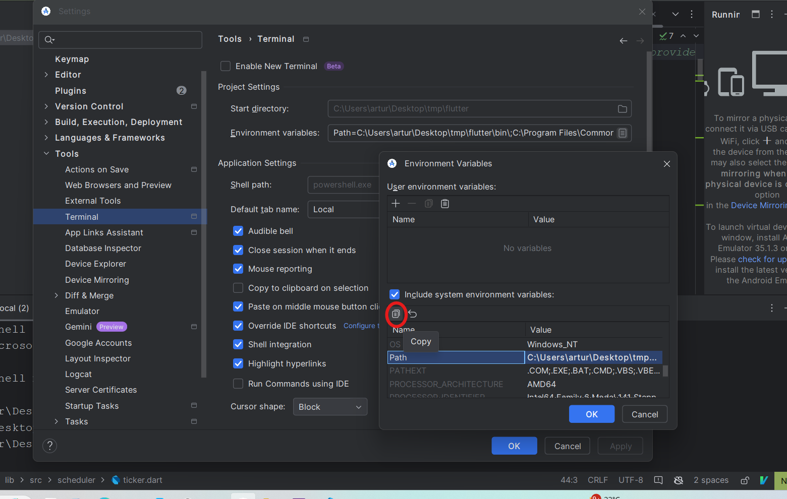
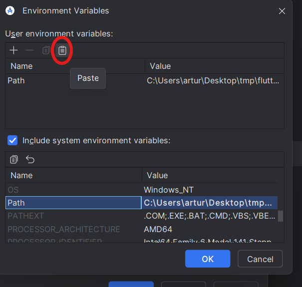
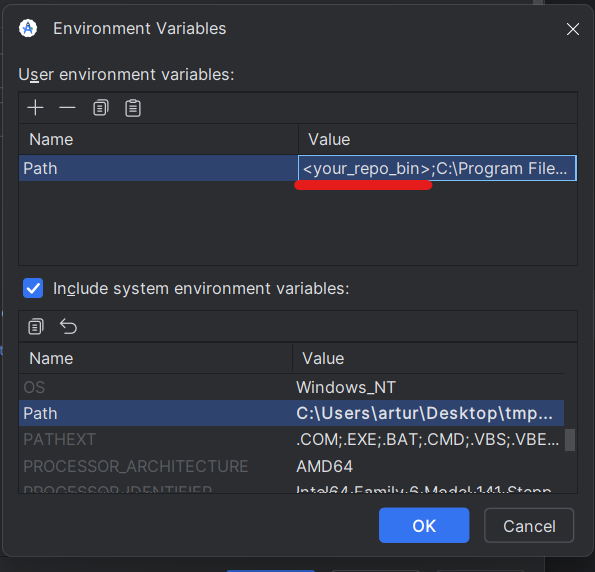
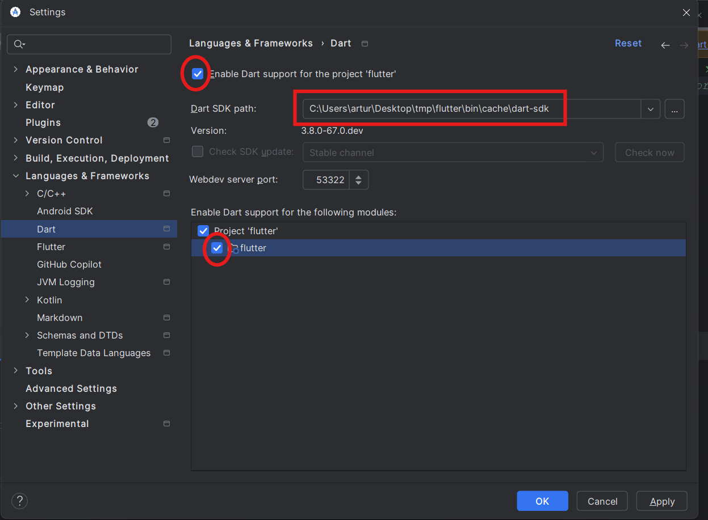
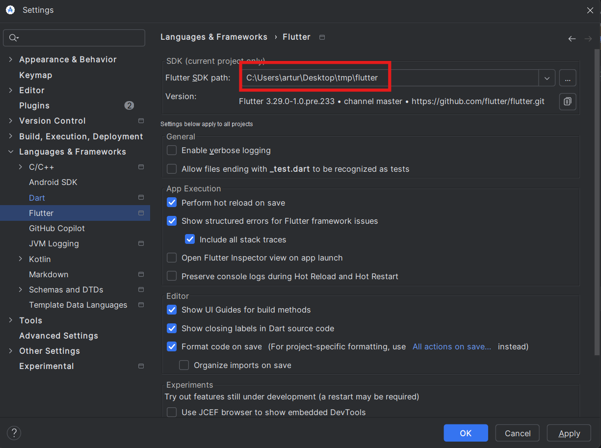

# Configuring the Environment

Before starting the development process, we are going to set up our environment. 
To do that, the following steps should be completed: 
1. Install necessary tools
1. Configure the Git environment
1. Sanity Check
    - Run flutter doctor tool
    - Run the analyzer
    - Run some tests
    - Run some examples
1. Configure your IDE
    - Android Studio
    - VS Code

## Tools
Given that the focus of this book is not on those tools, they will be listed 
with only enough information, adding any additional information as external 
resources.

- **Git**: Used as source version control. 
    - <a href="https://git-scm.com/downloads" target="_blank">Download and install</a>
    - <a href="https://git-scm.com/doc" target="_blank">Documentation</a>
        - <a href="https://git-scm.com/docs" target="_blank">Reference Manual</a>
        - <a href="https://git-scm.com/book/" target="_blank">Book</a>
        - <a href="https://training.github.com/" target="_blank">Cheat Sheet</a>
    - Related repositories: <a href="https://github.com/flutter/flutter" target="_blank">Flutter</a>, <a href="https://github.com/join-the-flock/flock" target="_blank">Flock</a>
- **Integrated Development Environment (IDE)**: there are a lot of IDEs out there, but two are very popular among flutter developers. Install the IDE with the *Flutter plugin/extensions* for each: 
    - <a href="https://docs.flutter.dev/tools/android-studio" target="_blank">Android Studio</a>
    - <a href="https://docs.flutter.dev/tools/vs-code" target="_blank">Visual Studio Code</a>
- **Python**: Some tools require that you have Python installed on your machine.
    - <a href="https://www.python.org/downloads/" target="_blank">Download and install</a>
- **Android Platform Tools**: Android SDK Platform-Tools is a component for the Android SDK. It includes tools that interface with the Android platform, primarily adb and fastboot. Although adb is required for Android app development, app developers will normally just use the copy Studio installs.
    - **Android Studio on Windows**: Usually, the Android SKD Platform-Tools are in the path: `C:\Users\<your_user>\AppData\Local\Android\Sdk\platform-tools`
    - **Activate those tools from your Android Studio** following the path `Tools/SDK Manager/Android SDK/SDK Tools`:
    
    - <a href="https://developer.android.com/tools/releases/platform-tools" target="_blank">Download</a> if you are not using the version from your IDE.

    <!-- TODO Is there any other tool that you can remember? Maybe something specific for flock. -->
    
## Configuring the Git Environment
The following tutorials show how to set up your git environment for both the
Original Flutter and the Flock repositories.  
### For Flutter
1. Clone the flutter/flutter repo using either SSH or HTTPS (SSH is recommended, but requires a working [SSH key](https://docs.github.com/en/authentication/connecting-to-github-with-ssh/about-ssh) on your GitHub account):
    - SSH: 
    ```bash
    git clone git@github.com:flutter/flutter.git
    ```
    - HTTPS: `git clone https://github.com/flutter/flutter.git`
    ```bash
    git clone https://github.com/flutter/flutter.git
    ```

1. Change into the directory of the cloned repository and rename the origin remote to upstream:
    ```bash
    cd flutter
    git remote rename origin upstream
    ```

1. [Fork the flutter/flutter repo](https://github.com/flutter/flutter/fork) into your own GitHub account.

1. Add your fork as the origin remote to your local clone either using SSH or HTTPS by replacing `<your_user>` with your GitHub account name:
    - SSH: 
    ```bash
    git remote add origin git@github.com:<your_user>/flutter.git
    ```
    - HTTPS: 
    ```bash
    git remote add origin https://github.com/<your_user>/flutter.git
    ```

1. Verify the upstream and origin repository you've specified for your clone.
    ```bash
    git remote -v
    ```

1. Add the repo's `bin` directory to your [PATH](https://en.wikipedia.org/wiki/PATH_(variable)): e.g. on UNIX, using `export PATH="$PATH:$HOME/<path to flutter repository>/bin"`

    - If you already have a Flutter installation you will either need to remove it from your PATH, or use a full path whenever you are running `flutter` in this repository. If you have version solving errors when trying to run examples below, you are running a version of Flutter other than the one checked out here.

1. `flutter update-packages`

   This will recursively fetch all the Dart packages that
   Flutter depends on. If version solving failed, try `git fetch upstream` to update Flutter versions before `flutter update-packages`.


### For Flock
TODO: consider contributing writing this part.


## Sanity Check
After configuring your repository, it's a good idea to perform a series of initial
validation checks to ensure your development environment is properly configured.
Let's walk through the crucial verification steps that will help establish a 
solid foundation for your development workflow.

### Running Flutter doctor
Flutter doctor shows information about the installed tooling. Running this 
command before beginning development work is particularly valuable as it 
provides early detection of configuration issues or missing dependencies. 

Now, let's run the command and check the results:
```bash
bin/flutter doctor
```
The image below shows a flutter doctor result that confirms no issues with the 
related tools. The only concern identified was that the Flutter version in use 
differed from the Flutter version specified in the system's PATH variable. That 
is not a problem if you remember to use your local Flutter version instead of 
the version of your system.




### Running the Analyzer
The dart analyzer is a static analysis tool that may be configured to
perform a lot of different checks in the dart code, allowing the identification
of bugs in an early stage (static analysis happens without the need of running
the code), automating some style specification, and more. 

It is very important for the Flutter/Flock framework development process, and it
is a good idea to start running it in your code to make you used to the process.

- Supposing that you are in the project root, change the directory to the flutter
package:
```bash
cd packages/flutter
```
- Execute the analyzer:
```bash
../../bin/flutter analyze 
```
or, if you have configured PATH:
```bash
flutter analyze 
```

When the project analysis completes successfully, you will see a confirmation 
message indicating that no issues were found, as shown in the image below:


You have now successfully completed the analyzer setup. Moving forward, you can 
utilize this tool to evaluate your code changes. As a best practice, run the 
analyzer before committing any new code to ensure quality and consistency.

### Running Tests
Testing represents a crucial component of code specification. Regular test 
execution is essential to maintain code integrity. A recommended practice is to 
run tests before each commit to ensure new code changes don't introduce 
regressions or break existing functionality.

To execute the complete framework test suite, use the following command from 
your current directory (`<root>/packages/flutter`):
```bash
../../bin/flutter test
```

Please note that a full test execution requires significant time. As illustrated
in the image below, the complete suite took over 6 minutes to run (depending on
the machine, it may take even longer):


The framework contains approximately 17,000 tests (early 2025), which explains 
the extended execution time. However, during development, you'll learn more 
efficient approaches to run targeted test subsets. The complete suite execution 
can be reserved for pre-commit validation.

The example execution above demonstrates positive results: the majority of tests
passed successfully. Some tests were marked as ignored (displayed in orange), 
and only two tests failed (displayed in red). While test failures can occur for 
various reasons, these results indicate a generally successful test execution, 
allowing us to proceed to the next phase.

The current Flutter project baseline starts with clean analyzer output and nearly all
tests passing. Your code changes should maintain this quality level without 
introducing new analyzer issues and test failures before committing it.

### Running Examples
Now, it's time to run some examples to check if everything is working correctly. 
Examples are an effective way to test new features we are developing, so it's 
important to learn how to run them.

Fortunately, we can use the existing HelloWorld example to verify if our framework 
installation is working correctly.
In the terminal, navigate to the root of your local Flutter repository. Then, go 
to the `examples/hello_world` directory. 
```bash
# From the root of your local Flutter repository
cd examples/hello_world
```
Here, you will be able to see the basic structure of a flutter application. 

Let's check which devices are available for running the example:
```bash
../../bin/flutter devices
```
As shown in the example below, we can see 4 available devices. We identify them 
by their id (the second column). For example, we have the following ids: `emulator-5554`,
`windows`, `chrome`, and `edge`. 



Obviously, the available devices may differ from what is shown here. You should 
check for your own available devices and identify their specific IDs.

Now, let's run the project on one of the available devices:
```bash
# For mobile emulator: use the emulator's ID (e.g., 'emulator-5554' in this
# example, though it may be different on your computer)
../../bin/flutter run -d  emulator-5554
```
or
```bash
# For windows
../../bin/flutter run -d windows
```
or
```bash
# For chrome
../../bin/flutter run -d chrome 
```
or
```bash
# For edge 
../../bin/flutter run -d edge 
```

If you see a screen similar to the one shown in the image below, congratulations,
you're on the right track!


## Configure your IDE
Although you know the basic commands for running tests, analyzer, and examples, 
it may be cumbersome to do the framework development without the help of a good
IDE. In this section, you will learn how co configure your IDE, making it possible
to take advantage from its features, including automatic calling for analyzer, 
test execution, syntax highlighting, etc.

### Android Studio
In order to configure Android Studio for the Framework development, we are going
to setup three things: 
1. Path variable for local environment
1. Dart SDK
1. Flutter SDK

#### Configuring Path
Go to Settings > Tools > Terminal and add the absolute path for `<your_repo_bin>`
as the first value for the Path environment variable. Follow the steps:




After adding your local Flutter framework bin path, click OK to add the variable
and apply the changes.

#### Configuring the Dart SDK
Go to Settings > Languages & Frameworks > Dart. Activate the boxes shown in the 
image below. Add the Dart SDK path as the same dart used by your local Flutter
repository (the path is under `flutter/bin/cache/dart-sdk`). 



Then, apply the changes.

#### Configuring the Flutter SDK
Go to Settings > Languages & Frameworks > Flutter. Add your local framework 
Flutter SDK path and apply the changes.



Congratulations, now your Android Studio will automatically run the analyzer,
tests, examples, your flutter version, syntax highlighting, etc, for you.

### VS Code 
TODO consider contributing by adding this section

## Summary
Congratulations on completing your environment setup! To recap: you've 
successfully installed all essential tools, configured Git, and validated your 
environment through Flutter Doctor, tests, and a sample application. This 
foundation prepares you for your journey into Flutter framework development.

### Key Directories
* `/bin`: Flutter executables (add to PATH)
* `/packages/flutter`: Main framework code
* `/examples`: Sample applications

### Repository Configuration Checklist
1. Run Flutter Doctor (once per repository)
2. Execute analyzer
3. Run relevant tests
4. Test changes on example app
5. Verify no regressions

In our next chapter, we'll create a HelloWorld widget together, a perfect 
introduction to making changes in the framework. This hands-on example will 
show you exactly how to implement and test modifications in Flutter.


## References
- Flutter Contribution Guide: <a href="https://github.com/flutter/flutter/blob/master/CONTRIBUTING.md" target="_blank">CONTRIBUTING.md</a>
- Setting up the Framework Development Environment: <a href="https://github.com/flutter/flutter/blob/master/docs/contributing/Setting-up-the-Framework-development-environment.md" target="_blank">Setting-up-the-Framework-development-environment.md</a>
- Video tutorial on how to contribute to the Flutter Framework: <a href="https://www.youtube.com/watch?v=4yBgOBAOx_A" target="_blank">How to contribute to Flutter (The Boring Flutter Development Show, Ep. 53)</a>
